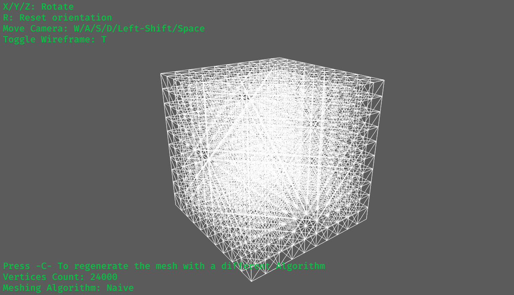
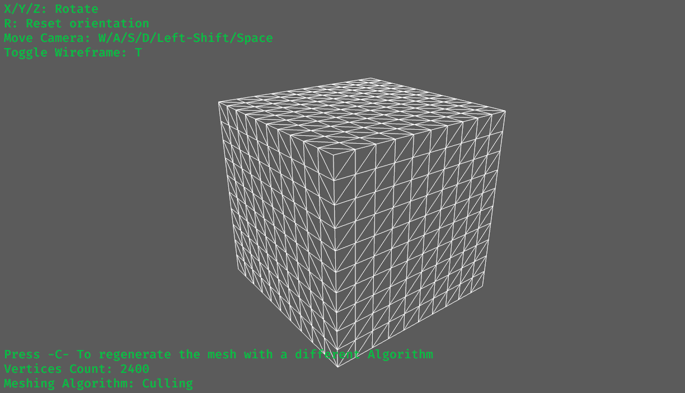

# Bevy Meshem
## ***Showcase (taken from [minecraft_bevy](https://github.com/Adamkob12/minecraft_bevy)):***


Bevy Compatibility:

| Bevy Version |  bevy_meshem         |
|--------------|----------------------|
| `0.12`       | `0.3.x`              |
| `0.11.x`     | `0.2.x`              |
| `0.11`       | `0.1.1`              |

Bevy Meshem is a Rust crate designed to provide meshing algorithms for voxel grids, enabling you to create cohesive 3D mesh structures from a grid of cubic voxels.
Similar to the mechanics in Minecraft, Bevy Meshem offers a powerful and flexible way to visualize voxel-based environments with efficient mesh generation.
Currently in pre-release stages of development.

## Features
### ___Generate 3d meshes:___
Just define a data structure that implements the simple "VoxelRegistry" trait (see examples and documentation) and you can turn any array of voxels into a 3d mesh.
### ___Run time mesh updating in O(1):___
Added in 0.2, this features allows users to easily update the mesh after it has been generated, without any need for regenerating. See the new update_mesh_example.

### ___Custom Shadowing, Similar to "Ambient Occlusion" (PBS)___
Added in 0.3, this feature allowes users to add an ambient occlusion-like effect during mesh generation, "proximity based shadowing":

### ___"Introducing" Chunks___
When generating each mesh, the unused vertices inside the mesh are being culled, but there was no way to automatically cull vertices trapped between two seperatly generated meshes, only manually.
Now `introduce_adjacent_chunks` will automatically do the job for you, and apply the shadowing mentioned above as well!
### "The Naive Method"
Iterate over the grid and generate a matching cube for each voxel (Also reffered to as the "default" as this method doesn't offer any optimization) examples: (screenshots from examples/simple_example.rs)


10x10x10 grid, each voxel is built out of 24 vertices, and the entire mesh is built out of 24000 (expected, 24 * 10 * 10 * 10)

### "Culling"
A slightly more sophisticated method, while iterating over the grid, we don't add any vertices and indices that are hidden behind other voxels. This is roughly the method that Minecraft uses in its
engine, though the specifics are obviously unknown. examples:


10x10x10 grid, but in contrast to The Naive Method, only 2400 are rendered.

### Not supported: "Greedy Meshing"
Greedy Meshing is even more effecient than Culling, but it makes very limiting compromises (specifically to the texture of the mesh), making it somewhat undesirable. Support for this method might be added in later stages.

## Requirements & Installation
- You must be familliar with the Bevy game engine, and of course the Rust programming language.
- You know the drill - add this incantation to your project's Cargo.toml file:
  ```toml
  [dependencies]
  bevy_meshem = "0.3"
  ```

## Usage
The example in examples/simple_example.rs shows what you need to do to get started.

***In 0.1, you provide a VoxelRegistry and a grid of voxels, and you get a mesh.***


***In 0.2, you can also log voxel changes in the MeshMD data-structure, and use the MeshMD data-structure to update the Mesh at run-time***


## Design Goals
Flexibillity, Stabillity, User experience and Performance.

## Contributing
Contributions are very welcome! This project is currently in its early stages and operates closely with the Bevy rendering API.
As a result, it may have some stability challenges. However, your contributions can play a significant role in enhancing and stabilizing the project.

## Credits
Thanks to mikollysenko writing this informative article!
https://0fps.net/2012/06/30/meshing-in-a-minecraft-game/
And to the Bevy Community, for building an awesome project!

